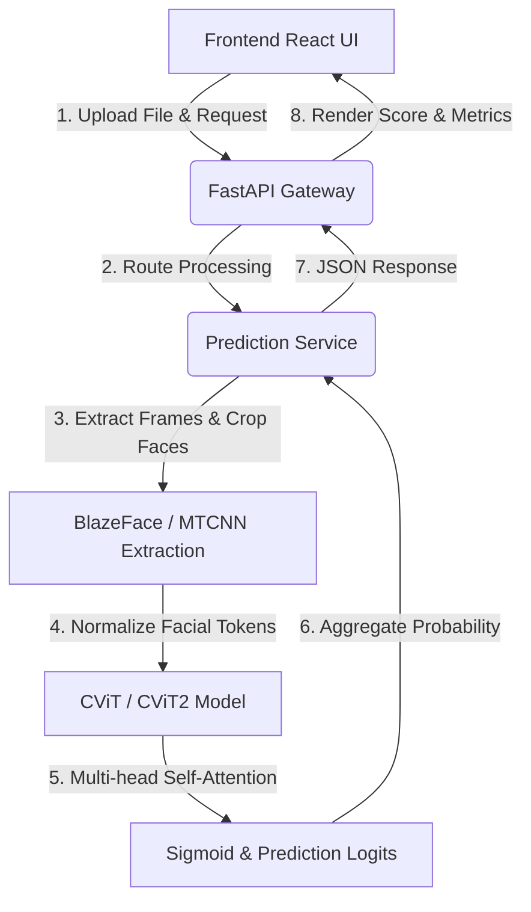

<div align="center">

# DeepLens AI
### *AI-Powered Deepfake Detection Platform using Vision Transformers (CViT)*

[](LICENSE)
[](https://www.python.org/)
[](https://react.dev/)
[](https://fastapi.tiangolo.com/)

**"See Beyond the Pixels. Detect the Truth."**

</div>

---

## Overview

In an era of hyper-realistic digital synthesis, the boundary between authentic media and AI-generated manipulation is increasingly blurred. **DeepLens AI** is a state-of-the-art Deepfake Detection Platform designed to inspect, identify, and audit facial manipulations in both images and videos. 

DeepLens AI integrates the innovative **Convolutional Vision Transformer (CViT & CViT2)** architectures. Standard convolutional networks are excellent at extracting local facial textures (e.g., blending seams, color mismatches) but often struggle to capture long-range temporal anomalies across video frames. On the other hand, traditional Vision Transformers are highly effective at tracking global dependencies but require massive training sets to learn local spatial structures. **CViT** solves this by inserting shallow, high-performance convolutional layers prior to a multi-head self-attention transformer block, offering the best of both worlds: local feature awareness and global context aggregation.

Detecting deepfakes is no longer just an academic pursuit; it is a critical necessity for preserving election integrity, combating identity fraud, preventing corporate misinformation campaigns, and protecting personal reputations.

---

## Features

- 🖼️ **Image Deepfake Detection**: Upload single facial images (`.jpg`, `.png`, `.jpeg`) to scan for structural spatial anomalies.
- 📹 **Video Deepfake Detection**: Upload video clips (`.mp4`, `.avi`, `.mov`) for frame-by-frame analysis and temporal sequence alignment.
- 🧠 **Vision Transformer (CViT / CViT2)**: Uses hybrid Convolutional Vision Transformer models trained on industry-standard datasets (DFDC, FaceForensics++, TrustedMedia, DeepfakeTIMIT, Celeb-DF-v2).
- ⚡ **Real-Time Inference**: Experience fast pipeline responses powered by BlazeFace landmark localization and PyTorch evaluations.
- 📊 **Confidence Score**: Clear statistical indicators showing the model's prediction probability and detection metrics.
- 📜 **Detection History**: Comprehensive local history log keeping track of past audits and classification details.
- 📈 **Analytics Dashboard**: Dynamic charts visualizing classification distributions, average processing times, and dataset logs.
- 📄 **PDF Reports**: Export comprehensive audit reports detailing media classification, confidence rates, model type, and audit logs.
- 📱 **Responsive UI**: Sleek, immersive dark-themed interface built to look stunning on both desktop and mobile layouts.
- 🚀 **FastAPI Backend**: Clean, asynchronous Python endpoints handling uploads, video extraction, and model orchestration.
- ⚛️ **React Frontend**: Optimized React single-page application built with TypeScript, Lucide React, and Tailwind CSS.

---

## Architecture

DeepLens AI connects a fast React client UI to a high-throughput FastAPI server orchestrating the PyTorch AI pipeline. Below is the workflow diagram:



---

## Tech Stack

- **Frontend**: React 18, TypeScript, Tailwind CSS, Framer Motion, Lucide Icons, Chart.js.
- **Backend**: FastAPI (Python 3.10), Uvicorn, Python-Multipart.
- **AI / Computer Vision**: PyTorch, Torchvision, BlazeFace, MTCNN, Decord (video frame reading), Einops (patch slicing).
- **Database**: LocalStorage (client-side history tracking).
- **Deployment**: Docker (ready), Hugging Face (weights hosting).

---

## Folder Structure

```
deeplens-ai/
├── CViT/                   # Python AI pipeline & backend
│   ├── backend/            # FastAPI source directory
│   │   ├── ai_model/       # PyTorch model definitions (CViT/CViT2)
│   │   ├── api/            # API routing handlers
│   │   └── services/       # Prediction orchestration
│   ├── weight/             # Local checkpoint directory (git-ignored)
│   └── verify_backend.py   # Development verification script
├── docs/                   # Academic PDFs and presentation slide files
├── frontend/               # React client application
│   ├── src/
│   │   ├── components/     # UI widgets and layouts
│   │   └── pages/          # Landing, Dashboard, Detector, About pages
│   └── package.json        # Node script configurations
└── LICENSE                 # Project MIT License
```

For a comprehensive explanation of every file and directory, see [PROJECT_STRUCTURE.md](PROJECT_STRUCTURE.md).

---

## Installation

Ensure you have Python 3.8+ and Node.js 18+ installed on your system.

### 1. Clone the Repository
```bash
git clone https://github.com/prempareesh/deeplens-ai.git
cd deeplens-ai
```

### 2. Configure Backend & Weights
1. Navigate to the backend folder:
   ```bash
   cd CViT
   ```
2. Create and activate a Python virtual environment:
   ```bash
   python -m venv .venv
   source .venv/bin/activate  # On Windows use: .venv\Scripts\activate
   ```
3. Install Python dependencies:
   ```bash
   pip install -r requirements.txt
   ```
4. Download the pretrained weights from Hugging Face:
   Create the directory `weight` if it does not exist:
   ```bash
   mkdir -p weight
   ```
   Download the weights files and save them in the `weight` folder:
   - **CViT2 Weight** (Recommended): [HuggingFace - cvit2_deepfake_detection_ep_50.pth](https://huggingface.co/datasets/Deressa/cvit/resolve/main/cvit2_deepfake_detection_ep_50.pth)
   - **CViT Weight**: [HuggingFace - cvit_deepfake_detection_ep_50.pth](https://huggingface.co/datasets/Deressa/cvit/resolve/main/cvit_deepfake_detection_ep_50.pth)

5. Run the backend verification script to test model loading:
   ```bash
   python verify_backend.py
   ```

6. Start the FastAPI backend server:
   ```bash
   python backend/main.py
   ```
   The backend will run at `http://localhost:8000`.

### 3. Configure Frontend
1. Open a new terminal window and navigate to the frontend folder:
   ```bash
   cd frontend
   ```
2. Install npm dependencies:
   ```bash
   npm install
   ```
3. Start the Vite React development server:
   ```bash
   npm run dev
   ```
   The application UI will run at `http://localhost:5173`.

---

## API Documentation

The FastAPI backend exposes standard Swagger docs at `http://localhost:8000/docs`.

### 1. Execute Prediction
- **Endpoint**: `POST /predict`
- **Content Type**: `multipart/form-data`
- **Parameters**:
  - `file`: Media file upload (image or video)
  - `media_type`: `"image"` or `"video"`
- **Response Example (`200 OK`)**:
  ```json
  {
    "prediction": "FAKE",
    "confidence": 98.42,
    "processing_time": 1.27,
    "media_type": "video"
  }
  ```

### 2. Fetch History Logs
*Note: History logging is managed client-side in the React application via LocalStorage for user privacy.*
- **Action**: `GET /history`
- **Resolution**: Retrieves audited entries from client state.

### 3. Clear History Logs
- **Action**: `DELETE /history`
- **Resolution**: Triggers clearing of LocalStorage logs.

---

## Screenshots

*Note: Visual interfaces showing the active state of DeepLens AI.*

### Landing Page
*(Placeholder for Landing Page - Hero introduction and entry portal)*

### Detection Page
*(Placeholder for Detection Page - Drag-and-drop file upload with live progress spinner)*

### Results Panel
*(Placeholder for Results Panel - Real-time statistics, confidence dial, and classification)*

### Analytics Dashboard
*(Placeholder for Analytics Dashboard - Charts illustrating audit trends and datasets)*

### History Logs
*(Placeholder for History Logs - Scrollable registry of past scans with PDF generation trigger)*

---

## Future Improvements

- 📹 **Live Webcam Detection**: Real-time camera feeds analyzing faces frame-by-frame.
- 📦 **Batch Processing**: Multiple file uploads processed in queue threads.
- 🔐 **Authentication**: User accounts, remote history sync, and team collaborations.
- ☁️ **Cloud Deployment**: Serverless AWS/GCP endpoint scaling for PyTorch inference.
- 🗺️ **Heatmap Visualization**: Grad-CAM overlays highlighting pixels contributing to the deepfake classification.
- 🔬 **Explainable AI (XAI)**: Detailed structural breakdowns explaining *why* the model flagged an image as synthetic.

---

## Contributing

We welcome your contributions! Please read [CONTRIBUTING.md](CONTRIBUTING.md) to learn how to open issues, suggest enhancements, and submit pull requests.

---

## License

Distributed under the MIT License. See [LICENSE](LICENSE) for details.

---

## Author

- **Prem Pareesh** - *Software Architect & Developer* - [@prempareesh](https://github.com/prempareesh)
- **Model Authors**: Deressa Wodajo, Solomon Atnafu, Peter Lambert, Glenn Van Wallendael, Hannes Mareen (Refer to [About](frontend/src/pages/About.tsx) for paper references).
